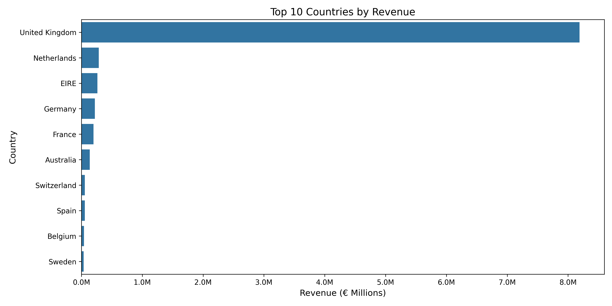
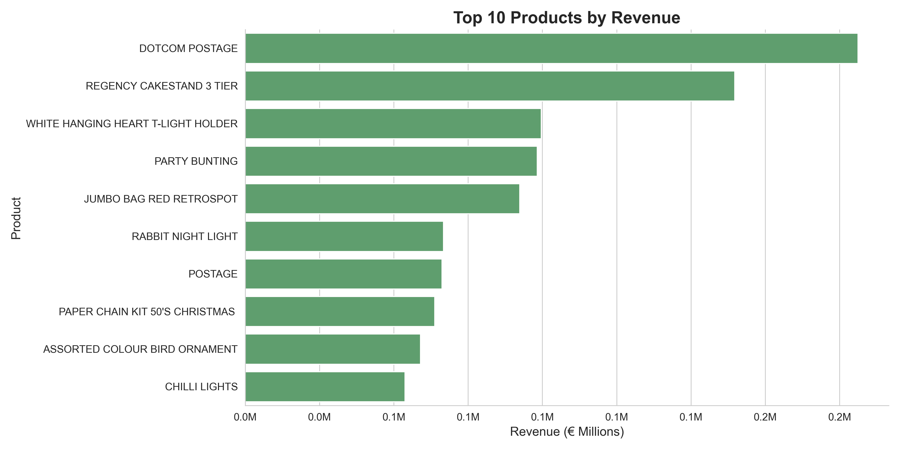
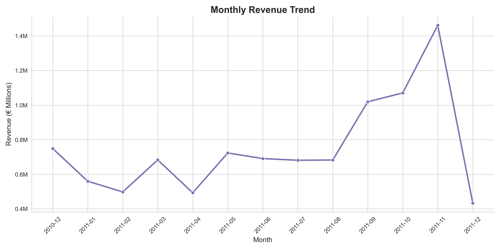
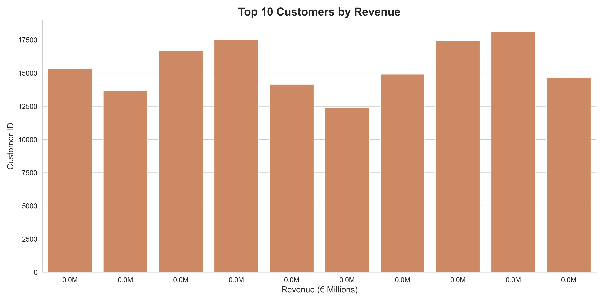

# E-commerce Sales Analysis (SQL + Python)

This project analyzes an e-commerce dataset to uncover key business insights using SQL and Python.

---

## Executive Summary

- The United Kingdom is the dominant revenue market  
- A small set of products drives a large share of total revenue  
- Sales show strong seasonality, with peaks in Q4  
- A small number of customers generate a significant portion of revenue  

---

## Overview

The goal of this project is to explore transaction-level data and answer important business questions related to revenue, customers, and product performance.

---

## Business Questions

- Which countries generate the most revenue?
- Which products generate the most revenue?
- How does revenue evolve over time?
- Who are the top customers?

---

## Dataset

- Source: Online Retail Dataset  
- Contains over 500,000 transactions  
- Includes product, customer, and country information  

---

## Tools & Technologies

- PostgreSQL  
- SQL  
- Python  
- Pandas  
- Matplotlib  
- Seaborn  

---

## Visualizations

### Revenue by Country


### Top Products


### Monthly Revenue Trend


### Top Customers


---

## SQL Analysis

The main queries include:

- Revenue by country  
- Top products by revenue  
- Monthly revenue trend  
- Top customers  

📂 See full queries in:  
`sql/analysis_queries.sql`

---

## Python Analysis

The dataset was analyzed using Python to:

- clean and prepare the data  
- compute revenue metrics  
- visualize business insights  

---

## Business Recommendations

- Focus marketing efforts on high-revenue countries  
- Optimize inventory for top-performing products  
- Prepare for seasonal demand spikes  
- Develop retention strategies for high-value customers    

---

## Project Structure
``` 
sql-ecommerce-analysis
│
├── online_rental.csv
├── ecommerce_sql_analysis.ipynb
├── analysis_queries.sql
├── monthly_revenue_trend.png
└── README.md
```


---

## Conclusion

This project demonstrates how SQL and Python can be combined to extract meaningful insights from raw transactional data and support data-driven decision making.